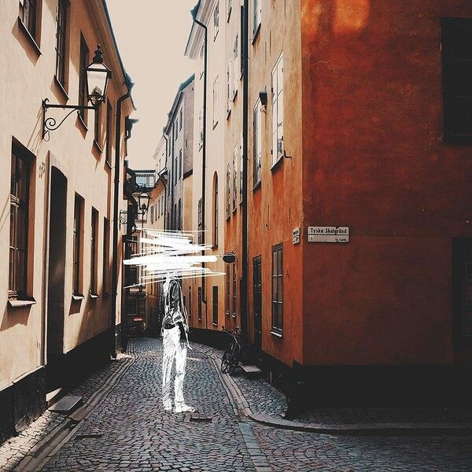

# The sense of the world must lie outside the world.

:envelope: Contact annaz.li@mail.utoronto.ca

  
  
:computer: [Personal Website](https://nana14.com)

:tv: [BiliBili Page](https://space.bilibili.com/439465595)

:musical_note: [Music Production](https://www.youtube.com/channel/UCBjv0x-eWOwNzmv5EuLw29g)

「青空だけが見たいのは我儘ですか。」

---

### Programming Language

